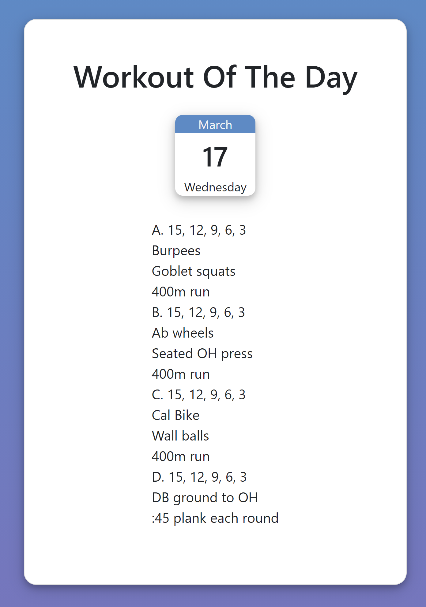

# Workout Of The Day App

*Display a random workout for the day.*

Try it [here](workout-of-the-day.netlify.app)

## Summary

I used a web scrapper written in python to collect workouts from one of my favorite fitness blogs. I used the collected data to create a simple application using react that displays random workouts. I used media queries to make the web app mobile friendly.

## Author

* **Bryan Herrera** - *Full-Stack Developer* - [Website](http://bryan-herrera.com) | [LinkedIn](https://www.linkedin.com/in/bryan-chris-herrera/)  